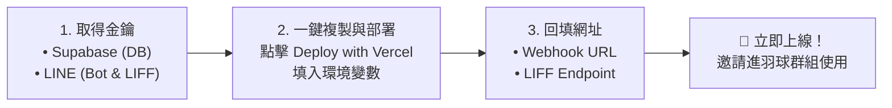

# 🏸 羽球零打報名 LINE 機器人 (Badminton LINE Bot)

這是一個專為 LINE 羽球零打社團群組設計的自動化報名與管理系統。
採用 **Next.js (App Router) + Supabase (PostgreSQL) + LINE Messaging API / LIFF** 開發，完全支援 **Vercel** 與 **Supabase Free Tier** 免費運行。

[](https://vercel.com/new/clone?repository-url=https%3A%2F%2Fgithub.com%2Flulu-lovebird%2Fbadminton-line-bot&env=SUPER_ADMIN_LINE_IDS,LINE_CHANNEL_ID,LINE_CHANNEL_SECRET,LINE_CHANNEL_ACCESS_TOKEN,LINE_LIFF_ID,LINE_LIFF_URL,SUPABASE_URL,SUPABASE_ANON_KEY,SUPABASE_SERVICE_ROLE_KEY&envDescription=%E8%AB%8B%E4%BE%9D%E7%85%A7%E9%83%A8%E7%BD%B2%E6%8C%87%E5%8D%97%E5%A1%AB%E5%85%A5%E6%82%A8%E7%9A%84LINE%E8%88%87Supabase%E9%80%A3%E7%B7%9A%E9%87%91%E9%91%B0&envLink=https%3A%2F%2Fgithub.com%2Flulu-lovebird%2Fbadminton-line-bot%2Fblob%2Fmain%2FDEPLOYMENT_GUIDE.md&project-name=badminton-line-bot&repository-name=badminton-line-bot)

---

## ✨ 核心功能特色

### 1. 一般球友功能 (LIFF 前端)
- **🏸 我要報名 (`/liff/sessions`)**：
  - 依日期篩選與瀏覽目前開放的零打場次。
  - 一鍵報名（支援攜伴 `+1`, `+2`, `+3`）。
  - **滿額自動備取**：正取滿額自動轉為備取順位 (備1, 備2...)。
  - **指定場次自動置頂**：點擊團主分享之專屬連結時，自動置頂並以綠色螢光框標註該場次。
  - **名冊透明度支援**：公開名單可即時展開查看已報名球友；私密名單保護隱私僅統計人數，球友可點選查詢個人錄取狀態。
- **📋 報名紀錄 (`/liff/my-records`)**：
  - 檢視個人所有報名紀錄與繳費狀態。
  - **時間衝突自動偵測**：若報名的兩場次時間重疊，以 **🔴 紅色底色** 明顯警示。
  - **取消報名**：一鍵取消，系統自動連動遞補機制。

### 2. 團主管理後台 (LIFF 前端 `/liff/admin`)
- **➕ 建立零打場次**：
  - 型式選擇（雙打／單打／不限）。
  - 人數下拉選單防呆：正取上限（預設 8 人，可選 2-32）、備取上限（預設 2 人，可選 0-10）。
  - 報名名單公開度設定（🌐 公開名單／🔒 私密名單）。
  - 支援一鍵沿用舊場次資料順延 7 天開團（自動清空名單）。
- **📊 場次總覽與名單管理**：
  - 場次進度顏色標記：**🟢 深綠色（已額滿）** / **🟡 淺綠色（招募中）**。
  - **修改場次內容**：未開始之場次可隨時調整時間、地點、用球、費用與人數上限（防呆不可低於已報名人數）。
  - **手動代報名**：團主可直接幫群組外朋友新增報名 (+1)。
  - **強制取消球友**：移除特定球友報名，自動遞補備取 1。
  - **收款對帳追蹤**：點擊切換繳費狀態，**🟠 橘色（待付款）** / **🟢 綠色（已付款）**。
- **📢 緊急推播通知**：
  - 針對單一場次的所有報名球友，一鍵批次發送 LINE 推播訊息（例如：臨時更換場地、停打通知）。

### 3. 核心自動化邏輯 (Backend)
- **🎉 備取自動遞補機制**：
  - 當正取球友或團主取消報名時，系統自動將排在第一位的備取球友遞補為正取，並透過 LINE 機器人自動發送一對一私訊通知！

---

## 💡 LINE 200 則免費額度保護機制 (Zero-Quota Architecture)

LINE 官方帳號免費方案（Free Plan）每個月僅提供 **200 則主動推播（Push Message）**。在群組營運時，若 Bot 主動向群組推播，**發送 1 次訊息就會乘上群內人數（例：50 人群組推播 1 次扣 50 則）**，開 4 次團就會導致整個月額度歸零！

為徹底解決此痛點，本專案特別設計了 **三大「0 額度消耗」分享機制**：


### 1. 📲 LIFF Share Target Picker（社群分享卡片）
* 透過 LINE LIFF SDK 的 `liff.shareTargetPicker`，喚起 LINE 原生的好友／群組分享器。
* **以「團主個人 LINE 身份」在群組送出原汁原味、美觀的 Flex Message 互動卡片**（自帶綠色「立即報名」按鈕）。
* **Bot 推播額度消耗：0 則！完全免費、無上限！**

### 2. 📋 一鍵複製報名 URL & 📝 完整揪團文案
* **複製專屬報名 URL**：複製形如 `https://liff.line.me/<LIFF_ID>/sessions?sessionId=<ID>`，貼入 LINE 群組會自動產生網頁預覽卡片，球友點擊立即精準定位該場次。
* **複製完整揪團文案**：自動排版好帶有羽球 emoji、時間、地點、費用、程度、用球及報名專屬連結的專業文案，一鍵複製後至群組長按貼上即可發布。
* **Bot 推播額度消耗：0 則！**

### 3. 💬 群組關鍵字被動回覆（ReplyToken 替代 Push）
* 球友在群組輸入「零打」或「場次」，Bot 是透過 **`replyToken`（被動回覆）** 回傳開放中的場次卡片。
* **LINE 官方規範：Reply Message 完全免費且無上限！**

### 4. 🛡️ 表單防呆開關與額度保護
* 團主建立場次表單中，「由 Bot 自動推播至群組」改為**選用開關（預設關閉）**，並附有額度警語。
* **保留珍貴的 200 則 Push 額度**，專門用於最核心的「有人取消時，1 對 1 私訊通知備取第一位球友已成功遞補正取」。

---

## 🚀 部署上線方式 (Deployment)

本專案支援 **兩大部署模式**：

### 模式 A：【免寫程式】網友 / 團主直接一鍵獨立部署（最推薦 ⭐⭐⭐⭐⭐）
**您完全不需要下載原始碼或安裝 Node.js**，直接以本 GitHub 倉庫為基礎，即可建立您專屬的獨立羽球零打小幫手：



1. **準備免費資料庫與 LINE 憑證**：
   - 依照 [DEPLOYMENT_GUIDE.md](DEPLOYMENT_GUIDE.md) 免費註冊 **Supabase**，並在 SQL Editor 貼上執行 [`supabase/schema.sql`](supabase/schema.sql)。
   - 依照指南在 **LINE Developers Console** 免費建立 Messaging API 頻道與 LIFF App。
2. **點擊一鍵部署按鈕**：
   - 點擊上方的 **「Deploy with Vercel」** 按鈕，Vercel 會自動複製本專案至您的 GitHub，並引導填寫環境變數。
3. **回填 Webhook 與 LIFF 網址**：
   - 部署完成後，將 Vercel 發放的正式網址回填至 LINE 後台即刻啟用！

👉 **完整詳細圖文說明請見**：[完整部署操作指南 (DEPLOYMENT_GUIDE.md)](DEPLOYMENT_GUIDE.md)

---

### 模式 B：【開發者】本地開發與自訂修改
如果您是工程師，希望自行修改功能、樣式或擴充邏輯：
1. Fork 本倉庫到您的 GitHub 帳號。
2. Clone 到本地環境：
   ```bash
   git clone https://github.com/您的GitHub帳號/badminton-line-bot.git
   cd badminton-line-bot
   npm install
   cp .env.example .env.local
   # 填入金鑰後啟動本地伺服器
   npm run dev
   ```
3. 推送至 GitHub 並關聯至 Vercel 進行自動 CI/CD 部署。
