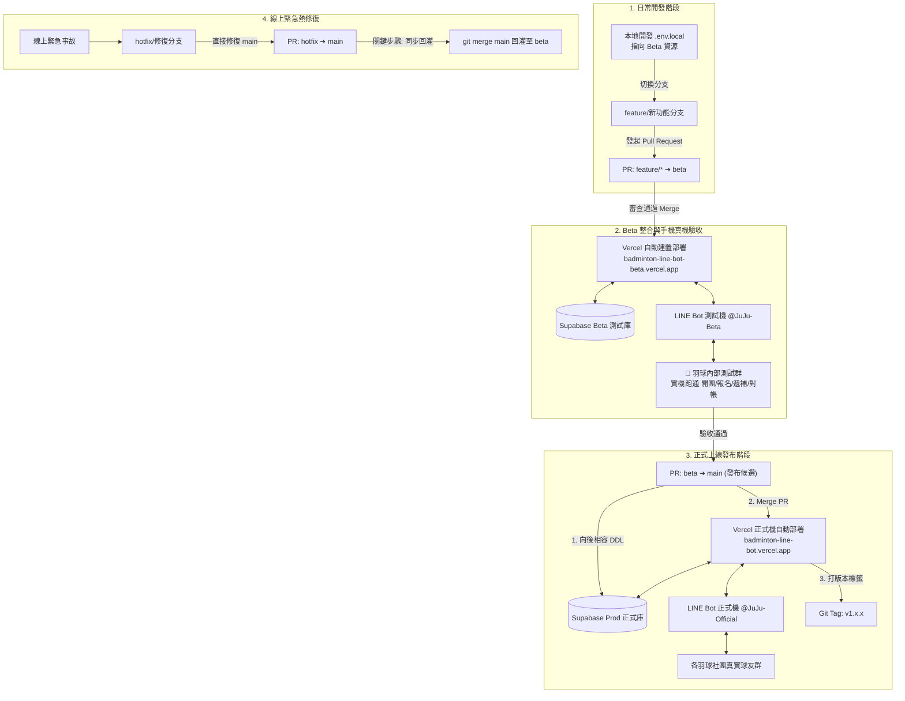

# 🚀 雙軌版控與發布作業指南 (Dual-Track Release Guide)

本指南規範「羽球零打小幫手」在多群組正式營運環境下，如何透過 **Beta 測試機** 與 **Production 正式機** 雙軌並行，達成「線上服務 0 中斷、新功能安心測試驗收、一鍵自動化發布」的工程流程。

---

## 🏗️ 一、 雙軌架構與資源隔離矩陣 (Environment Matrix)

為了避免測試開團、報名、取消等動作誤發推播至真實球友大群，或污染真實資料庫，**Beta 與 Production 必須維持 100% 獨立隔離**（均可在免費額度內達成）：

| 構件 | 🟢 正式營運環境 (Production) | 🟡 測試驗收環境 (Beta / Staging) |
| :--- | :--- | :--- |
| **Git 分支** | `main`（受保護分支，禁止直接 push） | `beta`（日常整合與預發布測試分支） |
| **Vercel 網域** | `https://badminton-line-bot.vercel.app` | `https://badminton-line-bot-beta.vercel.app` |
| **Vercel 環境範圍** | **Production** 專屬環境變數 | **Preview** 全域環境變數（含所有 PR 預覽） |
| **LINE 官方帳號** | 正式機（如：`羽球零打小幫手 JuJu`） | 獨立測試機（如：`JuJu 測試機 @Beta`） |
| **LINE Webhook** | `https://正式域名/api/webhook` | `https://測試域名/api/webhook` |
| **LIFF App** | 正式版 LIFF ID | 測試版 LIFF ID（開啟 Share Target Picker） |
| **Supabase 資料庫** | 正式庫（例如 `badminton-prod`） | 獨立測試庫（例如 `badminton-beta`，第 2 個免費專案） |
| **適用對象** | 全台各羽球社團、真實球友與團主 | 開發者、核心測試群友（「羽球內部測試群」） |

---

## 🔄 二、 開發與發布生命週期架構圖 (Architecture Workflow)



---

## 📋 三、 標準發布作業程序 (Step-by-Step SOP)

### 步驟 1：日常功能開發 (Feature Track)
1. 從 `beta` 分支切出新功能分支：
   ```bash
   git checkout beta
   git pull origin beta
   git checkout -b feature/awesome-feature
   ```
2. 本機 `.env.local` 一律填寫 **Beta 測試機的金鑰與連線網址**。
3. 開發完成並通過測試後，推送至 GitHub 並發起 Pull Request：  
   `feature/awesome-feature` ➔ **`beta`**。

### 步驟 2：Beta 整合與實機測試 (Beta Verification)
1. PR 合併進 `beta` 分支後，Vercel 會自動部署至：  
   `https://badminton-line-bot-beta.vercel.app`。
2. 進入維護團隊的「**羽球內部測試群**」進行驗證：
   - 測試團主開團 ➔ 點擊發送 Flex 卡片。
   - 測試球友報名、滿額自動候補。
   - 測試正取取消 ➔ 驗收是否收到私訊候補遞補通知。
   - 測試團主現場收款對帳與名冊權限。

### 步驟 3：發布至正式機 (Release from Beta to Production)
1. 確定功能驗收無誤後，在 GitHub 上發起發布 PR：  
   **`beta` ➔ `main`**（標題例如：`Release v1.1.0`）。
2. **資料庫遷移檢查（若有新增 SQL 欄位）**：
   - 登入 Supabase 正式專案的 SQL Editor，執行向後相容的遷移腳本。
3. **合併 PR 至 `main`**：
   - Vercel 將自動觸發 Production Build，約 1 分鐘內正式更新。
4. **建立 Git 版本標籤 (Git Tag)**：
   ```bash
   git checkout main
   git pull origin main
   git tag -a v1.1.0 -m "Release v1.1.0: 新增收款對帳與額度保護"
   git push origin v1.1.0
   ```

---

## 🛡️ 四、 Codex 架構審查防護鐵則 (Guardrails)

為確保雙軌長期穩定，請遵守以下 5 大關鍵防禦守則：

### 1. Vercel 環境變數作用域規則
- **生產環境 (Production)**：僅在 `Environment = Production` 填寫正式機金鑰。
- **預覽環境 (Preview)**：請直接在 `Environment = Preview`（勾選全部 Preview）填寫 Beta 金鑰。這樣所有開分支發 PR 的臨時預覽網站，也都能正常連到 Beta 測試資料庫，不會拋錯。

### 2. 資料庫遷移「擴展與收縮」原則 (Expand/Contract)
- **Vercel 的秒級回滾 (Instant Rollback) 只會回滾前端與 API 程式碼，無法回滾資料庫！**
- **鐵則**：新建立的欄位必須為 `Nullable` 或帶有 `DEFAULT` 值，嚴禁直接 `RENAME` 或 `DROP` 正在線上的舊欄位，確保即使程式碼緊急回滾到前一版本 (N-1)，舊程式碼依然能在新資料庫結構下正常讀寫。

### 3. Hotfix 緊急修復「同步回灌」防漂移
- 若線上出現緊急問題開了 `hotfix/*` 並合併至 `main`，**請務必在發布後立即執行回灌**：
  ```bash
  git checkout beta
  git pull origin beta
  git merge main
  git push origin beta
  ```
  避免 `beta` 與 `main` 程式碼脫節，導致下一次發布時發生複雜的 Git 衝突。

### 4. LINE LIFF 避免手機端強快取
- 手機版 LINE 內建 Webview 對靜態檔案有極強烈的本機快取。
- 本專案已在 HTML 路由強化防快取 Header，且在各頁面提供手動「重新整理 (繞過快取)」按鈕。

### 5. Supabase 測試庫 7 天防休眠
- Supabase 免費專案若連續 7 天無連線活動會進入暫停狀態。若一段時間未開發新功能，測試前若發現連線超時，登入 Supabase 點擊「Restore」即可於 1 分鐘內恢復。

---

## 🆘 五、 線上緊急回滾應變 (Emergency Rollback)

若正式機發布後發現重大未預期異常：
1. **極速前端/API 回滾**：
   - 立即登入 [Vercel Dashboard](https://vercel.com/) ➔ 點進專案 ➔ **Deployments**。
   - 找到前一個穩定版本的 Deployment，點擊右側 `...` ➔ **Instant Rollback**（2 秒內切換流量回前一版本，免重新編譯）。
2. **Git 倉庫狀態復原**：
   ```bash
   git checkout main
   git revert HEAD -m 1
   git push origin main
   ```
