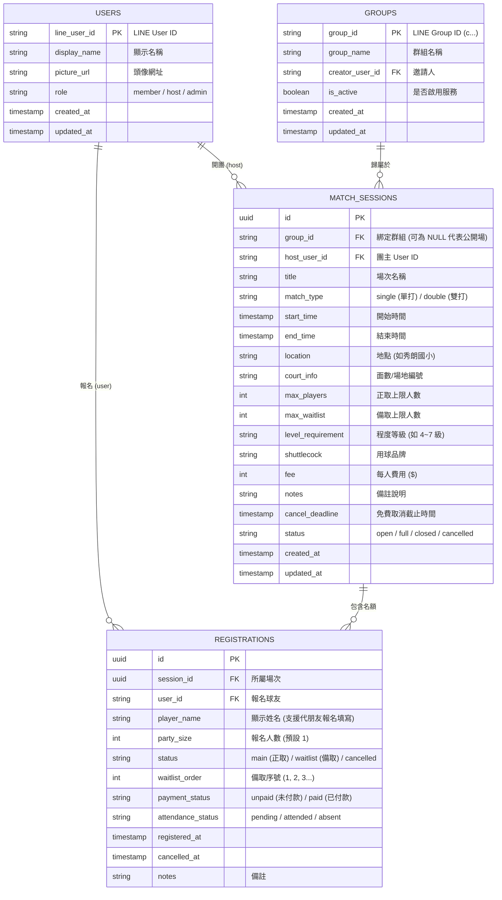

# 🏸 羽球零打報名 LINE 機器人系統設計規格書 (System Architecture & Specification)

---

## 📌 目錄
1. [系統概述與願景](#1-系統概述與願景)
2. [系統架構與技術棧](#2-系統架構與技術棧)
3. [多群組架構 (Multi-Tenant) 與隔離設計](#3-多群組架構-multi-tenant-與隔離設計)
4. [使用者角色與權限模型 (RBAC)](#4-使用者角色與權限模型-rbac)
5. [資料庫模型設計 (Database Schema)](#5-資料庫模型設計-database-schema)
6. [功能模組與互動流程 (User Flows)](#6-功能模組與互動流程-user-flows)
   - 6.1 一般球友端 (Member)
   - 6.2 零打團主端 (Host)
   - 6.3 系統最高管理員端 (Super Admin)
7. [防洗版、隱私保護與安全性設計](#7-防洗版隱私保護與安全性設計)
8. [API 規格與端點一覽](#8-api-規格與端點一覽)
9. [部署指南與環境變數設定](#9-部署指南與環境變數設定)

---

## 1. 系統概述與願景
傳統 LINE 羽球社團使用「複製貼上名單 +1」常常面臨**訊息覆蓋、搶名額糾紛、棄單遞補混亂、欠款對帳困難、群組嚴重洗版**等問題。

本系統採用 **LINE Bot + LIFF (輕量彈窗網頁)** 架構：
- **操作體驗**：球友無需跳出 LINE，在群組或私訊中以直覺的圖形化介面 1 秒完成報名。
- **名額控制**：資料庫級即時判定，額滿自動轉備取。
- **自動化遞補**：正取取消報名時，系統**自動將備取第 1 位轉為正取**並以 LINE 私訊發送遞補成功通知。
- **多群組共用 (Multi-Tenant)**：單一 LINE Bot 即可同時服務多個不同的羽球社團群組，資料獨立隔離。

---

## 2. 系統架構與技術棧

```
┌─────────────────────────────────────────────────────────────┐
│                    LINE 用戶端 (手機 / 電腦)                 │
│   • LINE 群組聊天室 (Group)   • 小幫手一對一私訊 (1-on-1)   │
└──────────────────────────────┬──────────────────────────────┘
                               │
                               ▼
┌─────────────────────────────────────────────────────────────┐
│              Next.js 14+ 全端應用程式 (託管於 Vercel)          │
│                                                             │
│   [ 前端 LIFF 介面 (React / Tailwind CSS / Lucide) ]         │
│   ├── /liff/sessions     (我要報名、瀏覽開放場次)           │
│   ├── /liff/my-records   (報名記錄、時間衝突警示、取消)     │
│   ├── /liff/admin        (團主後台：開場、收款對帳、代報名) │
│   └── /liff/super-admin  (最高管理：群組停權、退群、團主審核)│
│                                                             │
│   [ 後端 API Routes & Webhook (TypeScript / Node.js) ]       │
│   ├── /api/webhook       (接收 LINE 事件，防洗版智慧回覆)   │
│   ├── /api/sessions      (場次查詢、依群組過濾、建立場次)   │
│   ├── /api/registrations (報名、自動遞補、對帳、行蹤防窺)   │
│   ├── /api/notify        (緊急廣播推播至單場球友)           │
│   └── /api/admin/*       (群組授權/退群、團主升降權限)      │
└──────────────────────────────┬──────────────────────────────┘
                               │
                               ▼
┌─────────────────────────────────────────────────────────────┐
│           PostgreSQL 資料庫 (託管於 Supabase Free Tier)      │
│   • users           • groups           • match_sessions     │
│   • registrations   • Database Triggers & Indexes           │
└─────────────────────────────────────────────────────────────┘
```

| 層級 | 推薦技術 / 工具 | 說明 |
| :--- | :--- | :--- |
| **前端 (LIFF)** | Next.js App Router, React, Tailwind CSS | 極速開啟，原生 App 級別的手機操作體驗。 |
| **後端 (Serverless)** | Next.js API Routes (TypeScript) | 處理 Webhook、業務邏輯與 API，免伺服器維護。 |
| **資料庫** | Supabase (PostgreSQL) | 免費額度 500MB，具備強大事務交易與索引能力。 |
| **通訊與認證** | `@line/bot-sdk`, `@line/liff` | LINE 官方驗證 ID Token，保證操作者身分真實。 |
| **雲端託管** | Vercel (Hobby Free) | 自動提供免費 HTTPS 憑證，完美契合 LINE Webhook。 |

---

## 3. 多群組架構 (Multi-Tenant) 與隔離設計

系統採用 **單一 Bot 多群共用模式**，無需為各群組申請不同的 LINE 機器人：
1. **加入事件捕獲**：小幫手被拉進群組時，Webhook 自動捕獲 `join` 事件，將 `groupId` 記錄至 `groups` 資料表，並發送該群專屬歡迎卡片。
2. **場次資料隔離**：每筆場次 (`match_sessions`) 綁定特定 `group_id`。
   - A 群成員點開清單時，網址帶有 `?groupId=A`，**只會看到 A 群開的場次**。
   - B 群開團訊息**只會推播至 B 群**，絕不跨群串線。
3. **跨群行程整合**：同位球友若同時加入多個羽球群組，在小幫手私訊查看「我的報名記錄」時，系統能整合其所有群組的行程，並統一進行時間衝突偵測。

---

## 4. 使用者角色與權限模型 (RBAC)

系統定義三級權限架構：

```
[ 一般球友 member ] ──> 可報名、備取、查看個人行程、取消個人名額
         │
         ▼ (由超級管理員授權)
[ 零打團主 host ]   ──> 可開場次、查看完整名單、手動代報名、對帳收款切換、場次緊急推播
         │
         ▼ (由 .env SUPER_ADMIN_LINE_IDS 設定)
[ 最高管理員 admin ] ──> 可查看所有群組、一鍵暫停群組服務、強制退群、開通/撤銷團主權限
```

---

## 5. 資料庫模型設計 (Database Schema)

完整 SQL 定義位於 [`supabase/schema.sql`](supabase/schema.sql)：



---

## 6. 功能模組與互動流程 (User Flows)

### 6.1 一般球友端 (Member)
1. **瀏覽開放場次 (`/liff/sessions`)**：
   - 依日期（Date Picker）篩選未來場次。
   - 卡片即時顯示：時間、地點、用球、費用、程度、目前進度（`招募中 (6/8)` 或 `已額滿`）。
2. **一鍵報名與攜伴**：
   - 支援選擇人數：`1 人 (+1)`、`2 人 (+2)`、`3 人 (+3)`。
   - 若尚有名額：直接列入**正取名單**。
   - 若正取已滿：按鈕自動變更為「登記備取」，依排入順序給予「備取第 N 位」。
3. **個人報名記錄與衝突警示 (`/liff/my-records`)**：
   - 僅展示該球友本人的所有未來場次與應繳金額。
   - **時間衝突演算法**：若報名的兩場次時間有任何重疊交集，卡片**自動標示 🔴 紅色底色與警告標籤**。
4. **自主取消報名**：
   - 點擊「取消報名」並確認後，系統釋出名額，並**自動觸發備取遞補程序**。

---

### 6.2 零打團主端 (Host - `/liff/admin`)
1. **建立新場次**：
   - 填寫型式（單/雙打）、日期起訖時間、地點面數、正備取上限、用球、費用、程度與備註。
   - 儲存後自動生成精美 **LINE Flex Message 卡片** 推播至綁定的群組。
2. **場次進度總覽**：
   - 狀態顏色指示：🟢 **深綠色** 代表正取已全滿；🟡 **淺綠色** 代表熱烈招募中。
3. **球友名單與現場收款對帳**：
   - 查看排定的正取（1, 2, 3...）與備取（備1, 備2...）名單。
   - **一鍵切換收款狀態**：點擊切換 🟠 **待付款 (橘色)** / 🟢 **已付款 (綠色)**。
   - **手動代報名**：支援直接輸入朋友名字完成手動 +1。
   - **強制移除球友**：團主可手動移除某位報名者，名額自動由備取遞補。
4. **場次緊急通知推播 (Broadcast)**：
   - 若遇場地臨時更換、停打等突發狀況，團主在後台輸入訊息點擊「推播」，小幫手立即**以 LINE 私訊一對一推播給該場次的所有正取與備取球友**。

---

### 6.3 系統最高管理員端 (Super Admin - `/liff/super-admin`)
1. **合作群組管理 (Groups)**：
   - 查看目前已加入的所有群組名稱、Group ID 與開團歷史統計。
   - **暫停該群服務 (Deactivate)**：一鍵切換群組啟用狀態。停用後該群成員與團主皆無法使用小幫手。
   - **強制機器人退群 (Leave Group)**：調用 LINE 官方退群 API，讓小幫手主動退出該群組，徹底解除關係。
2. **團主名單審核與授權 (Hosts)**：
   - 瀏覽系統所有使用者與當前身分。
   - 一鍵將特定球友升格為「零打團主 (`host`)」，或將不適任團主「撤銷團主」降為一般球友。

---

## 7. 防洗版、隱私保護與安全性設計

### 🛡️ 7.1 群組防洗版機制 (Anti-Spam)
- **智慧場景辨識**：
  - 在**一對一私訊**輸入關鍵字：回傳完整的橫向 Carousel 大卡片。
  - 在**群組聊天室**輸入「我要報名」或「零打」：**只回傳極簡微型按鈕卡**（高度僅原本 1/5），點擊開彈窗操作，避免大卡片佔滿群組。
- **置頂公告最佳實踐**：
  - 團主可將開團卡片直接設為「LINE 群組置頂公告」，球友點頂部即可進入，達成**群組 0 人打字、0 洗版**。

### 🔒 7.2 個人隱私保護 (Privacy Protection)
- **防止行蹤外洩 (IDOR 防護)**：
  - 查詢個人紀錄時，後端強制驗證 LINE 發放之 `id_token`，只允許讀取登入者本人的行程。
- **名單資料脫敏 (Data Masking)**：
  - 一般球友檢視場次名單時，系統自動過濾並隱藏他人的 LINE User ID、繳費狀態與私密備註，僅呈現暱稱與人數。

### 🚫 7.3 防幽靈人口與非群成員偷窺 (Group Membership Auth)
- **官方級即時驗證**：
  - 檢視群組場次或送出報名時，後端即時調用 LINE 官方 API `getGroupMemberProfile(groupId, userId)`。
  - 若對方未加入該群組（如單純加小幫手好友或點擊轉發連結），系統直接阻擋並回傳 `403 Forbidden`，外人**100% 無法窺探私密場次或搶佔名額**。

---

## 8. API 規格與端點一覽

| 方法 | 端點路徑 | 說明 | 權限需求 |
| :--- | :--- | :--- | :--- |
| `POST` | `/api/webhook` | 接收 LINE 官方 Webhook 事件 (加入群組、文字指令) | LINE 簽名驗證 |
| `GET` | `/api/auth/me` | 驗證 LINE ID Token，回傳個人檔案、角色與是否為 Super Admin | 登入球友 |
| `GET` | `/api/sessions` | 查詢開放場次（支援 `date`, `status`, `groupId` 篩選） | 群組成員 / 公開 |
| `POST` | `/api/sessions` | 建立新零打場次，並自動發送 Flex Message 卡片 | 團主 (`host`) |
| `GET` | `/api/registrations` | 查詢個人報名紀錄（自動偵測時間衝突）或場次名單 | 登入球友 / 團主 |
| `POST` | `/api/registrations` | 球友報名 / 備取排隊 / 團主代報名 (+1) | 群組成員 / 團主 |
| `PATCH` | `/api/registrations` | 取消報名（觸發自動遞補）或修改付款狀態（橘/綠切換） | 當事人 / 團主 |
| `POST` | `/api/notify` | 向指定場次的所有報名球友發送緊急私訊推播 | 團主 (`host`) |
| `GET` | `/api/admin/groups` | 取得系統所有合作群組清單與場次統計 | 超級管理員 (`admin`) |
| `PATCH` | `/api/admin/groups` | 切換群組啟用/停用，或執行主動退群 (`leaveGroup`) | 超級管理員 (`admin`) |
| `GET` | `/api/admin/users` | 取得全系統球友清單與角色狀態 | 超級管理員 (`admin`) |
| `PATCH` | `/api/admin/users` | 開通或撤銷球友之團主 (`host`) 身分 | 超級管理員 (`admin`) |

---

## 9. 部署指南與環境變數設定

### 步驟 1: Supabase 資料庫建置
1. 前往 [Supabase](https://supabase.com) 建立免費專案。
2. 進入 **SQL Editor**，複製專案中的 [`supabase/schema.sql`](supabase/schema.sql) 貼上並執行。
3. 至 **Project Settings** -> **API** 複製 `Project URL` (`SUPABASE_URL`)、`anon key` (`SUPABASE_ANON_KEY`) 與 `service_role key` (`SUPABASE_SERVICE_ROLE_KEY`)。

### 步驟 2: LINE 開發者後台設定
1. **Messaging API**：
   - 取得 `Channel ID`、`Channel Secret` 與 `Channel Access Token`。
   - 將 Webhook URL 設定為：`https://你的域名/api/webhook` 並開啟 Webhook。
2. **LIFF (LINE Front-end Framework)**：
   - 新增 LIFF App，Endpoint 設定為你的 Vercel 網址（例如：`https://你的域名/liff/sessions`）。
   - Scope 勾選 `profile` 與 `openid`。
   - **Share Target Picker** 設定為 `On`。
   - 取得 `LIFF ID` (`LINE_LIFF_ID`)，對應網址為 `LINE_LIFF_URL`。

### 步驟 3: 環境變數設定 (`.env.local` / Vercel)
```bash
# 系統超級管理員 (填入您的 LINE User ID，多個可用逗號隔開)
SUPER_ADMIN_LINE_IDS=U1234567890abcdef1234567890abcdef

# LINE 開發者金鑰
LINE_CHANNEL_ID=your_line_channel_id
LINE_CHANNEL_SECRET=your_line_channel_secret
LINE_CHANNEL_ACCESS_TOKEN=your_line_channel_access_token

# LIFF 設定 (透過 next.config.ts 安全映射至前端)
LINE_LIFF_ID=your_liff_id
LINE_LIFF_URL=https://liff.line.me/your_liff_id

# Supabase 資料庫連線
SUPABASE_URL=https://your-project.supabase.co
SUPABASE_ANON_KEY=your_supabase_anon_key
SUPABASE_SERVICE_ROLE_KEY=your_supabase_service_role_key

# 系統除錯與快取 (選填)
DEBUG=off
SESSION_CACHE_TTL_SECONDS=30
```

### 步驟 4: 部署到 Vercel
1. 將程式庫推送到 GitHub。
2. 在 Vercel 匯入專案，填入上述環境變數。
3. 點擊 **Deploy** 完成上線！詳細操作請參考 [DEPLOYMENT_GUIDE.md](DEPLOYMENT_GUIDE.md)。
